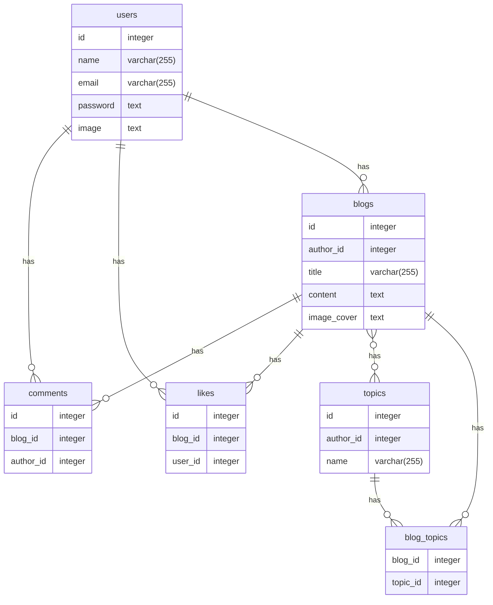

# Blog Platform API

## Overview

This application serves as a backend for a blog platform, providing essential operations for managing users, blogs, and comments. The API includes features such as authentication (login, signup), user profile updates, password changes, blog creation, updating, and deletion. Users can also list all blogs, retrieve specific blogs, and filter blogs by topic. Additionally, the API supports comment management, allowing users to add, delete, and update comments.

## Technologies Used

- Golang
- Gin
- Gorm
- PostgreSQL

## ERD
